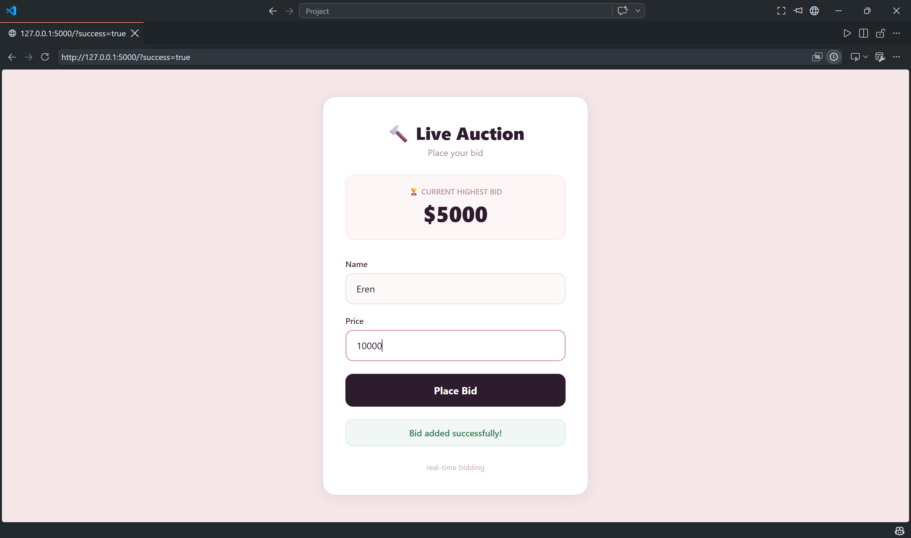
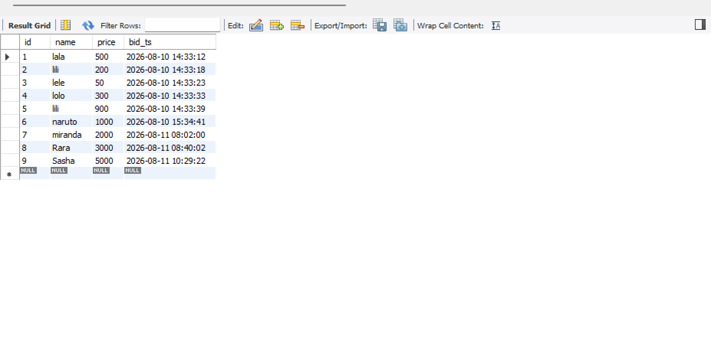
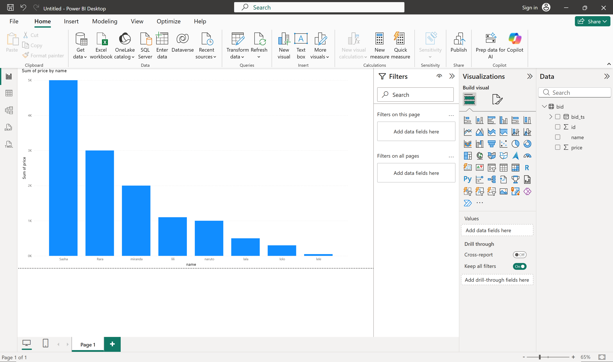

# Live Data Streaming Using Kafka

> **Live Data Streaming Project:** Kafka + Flask + MySQL + Power BI

## 📌 I. Project Overview

This project demonstrates an end-to-end **real-time data pipeline** for an auction bidding system. Users submit bids through a web interface, which are then streamed through **Apache Kafka**, processed by multiple consumers in parallel, stored in a **MySQL database**, and visualized in a **Power BI dashboard**.

### 1.1 The Problem We're Solving

Imagine running an auction platform where:
- Multiple users submit bids simultaneously
- You need to process these bids quickly
- You want real-time insights into bidding trends
- You need fault-tolerance and scalability

### 1.2 Why Kafka Instead of Direct Database Writes?

| Approach | Issue |
|----------|-------|
| Direct Flask → MySQL | Single point of failure, no parallelism, scaling nightmare |
| Flask → Kafka → MySQL | Distributed, fault-tolerant, multiple consumers work in parallel |

### 1.3 Key Benefits of This Architecture

- **Parallel Processing** — Multiple consumers share the load
- **Scalability** — Kafka topics can handle massive data volumes
- **Fault Tolerance** — Replication ensures data safety
- **Decoupling** — Producers and consumers work independently
- **Real-time** — Near-instant data streaming

---

## 🖇️ II. Architecture Components

### 2.1 Producer — Flask Web Application

**What it does:**
- Displays a web form for users to submit bids
- Fetches the current highest bid from the database (for user reference)
- On form submission, publishes the bid data to a Kafka topic
- Auto-generates test data when fields are left empty (for demo purposes)

**Tech:** Flask (Python), HTML, CSS

### 2.2 Kafka — Self-Hosted with Docker

**Apache Kafka** is a distributed streaming platform that handles real-time data feeds. This project uses **Docker** to run Kafka locally in KRaft mode (no ZooKeeper required).

#### Key Concepts:

**Topic**
- A named log where messages are stored
- Example: `auction` topic for all bidding records
- Partitioned for parallelism

**Partition**
- A subset of a topic (like sharding in databases)
- Each partition has an ordered sequence of messages
- Offsets act as unique IDs within a partition
- Multiple partitions enable parallel processing

**Offset**
- A unique sequential ID for each message within a partition
- Starts from `0` (or `-1` when empty)
- Consumers track offsets to know which messages have been processed

**Broker**
- A Kafka server that stores data
- Each broker handles partitions and replication

**Producer**
- An application that publishes messages to Kafka topics
- In our case: Flask app sends bid data to Kafka in JSON format

**Consumer**
- An application that reads messages from Kafka topics
- In our case: Python scripts that read bids and store them

**Consumer Group**
- A group of consumers working together
- **Group 1 (`group1`):** Consumers 1 & 2 → Write to MySQL
- **Group 2 (`group2`):** Consumer 3 → Write to backup CSV file

> **Important:** Consumers in the same group share the workload (each gets different partitions).

### 2.3 Consumer Groups

#### 2.3.1 Group 1: Database Writers — Parallel Processing
- **Consumer 1 (`db_writer1.py`)** → Reads messages → Inserts into MySQL
- **Consumer 2 (`db_writer2.py`)** → Reads messages → Inserts into MySQL

Both run in parallel. Kafka automatically distributes messages between them.

**Example:**
> 5 bids processed → 3 by Consumer 1, 2 by Consumer 2

**Time saved:** Messages are processed faster through parallel execution.

#### 2.3.2 Group 2: Backup Writer
- **Consumer 3 (`file_writer.py`)** → Reads all messages → Appends to `output.csv`
- Runs independently in a different consumer group
- Creates a backup of all bidding data
- Useful for audit purposes or simple data export

**Consumer Code Flow:**
1. Connect to Kafka topic
2. Poll for messages
3. Deserialize JSON messages (convert from bytes)
4. Perform operation (DB insert or file append)
5. Auto-commit offset (mark as processed)

### 2.4 MySQL Database

**Table Schema**
```sql
CREATE TABLE bid (
    id INT PRIMARY KEY AUTO_INCREMENT,
    name VARCHAR(50),
    price INT,
    bid_ts TIMESTAMP
);
```

**Why `AUTO_INCREMENT`?**
- Each bid needs a unique identifier
- Multiple bids from same user should be distinguishable
- Helps track bid history

**Connection Details**
- **Database:** `test`
- **Host:** `localhost`
- **User:** `root`
- **Password:** `1234`

Used by both Flask (to get max bid) and Consumers (to insert bids).

### 2.5 Power BI Dashboard

**What it does:**
- Connects to MySQL database via ODBC
- Loads bidding data
- Creates visualizations (charts, KPI cards, tables)
- Can be refreshed to show latest data

**Connection Steps:**
1. Install MySQL ODBC driver
2. Create a Data Source Name (DSN) in ODBC Administrator
3. In Power BI: **Get Data → ODBC → Select DSN**
4. Load the `bid` table
5. Build visualizations

### 2.6 Real-World Data Examples

This pipeline works for any real-time data scenario:

| Industry | Example |
|----------|---------|
| **Banking** | Transaction processing |
| **Sports** | Live score updates |
| **Gaming** | Player actions and leaderboards |
| **Stock Market** | Price feeds and trading activity |
| **IoT** | Sensor data streaming |

---

## ⚠️ III. Key Lessons and Potential Enhancements

### 3.1 What I Learned

| Concept | Description |
|---------|-------------|
| **Event-Driven Architecture** | Asynchronous communication; decoupled producers/consumers |
| **Kafka as Distributed Log** | Handles streaming beyond just messaging; replay capability |
| **Parallel Processing** | Multiple consumers share workload; faster processing |
| **Deserialization** | Converting binary messages back to readable JSON format |
| **End-to-End Ownership** | Full pipeline: generation → ingestion → processing → storage |
| **Tech Integration** | Python + Kafka + MySQL + Power BI working together |
| **Consumer Groups** | Same group = load balancing; Different group = independent processing |

### 3.2 Potential Enhancements

- Add more bidding fields (product name, quantity, etc.)
- Implement ACID transactions for critical operations
- Use batch inserts for better performance
- Add monitoring (Kafka lag, consumer health)
- Containerize everything with Docker for easier deployment
- Add error handling and retry logic
- Implement WebSockets for real-time UI updates

---

## IV. Setup Instructions

### Prerequisites
- Docker and Docker Compose installed
- Python 3.x installed
- MySQL installed locally
- Git (for version control)

### Step 1: Start Kafka with Docker
```bash
docker-compose up -d
```

This starts:
- Kafka broker on port `9092`

### Step 2: Create MySQL Database
```sql
CREATE DATABASE test;
USE test;
CREATE TABLE bid (
    id INT AUTO_INCREMENT PRIMARY KEY,
    name VARCHAR(255),
    price INT,
    bid_ts DATETIME
);
```

### Step 3: Install Python Dependencies
```bash
pip install flask mysql-connector-python confluent-kafka
```

Or use `requirements.txt`:
```bash
pip install -r requirements.txt
```

### Step 4: Start the Consumers (in separate terminals)
```bash
# Terminal 1
python db_writer1.py

# Terminal 2
python db_writer2.py

# Terminal 3
python file_writer.py
```

### Step 5: Start the Flask App
```bash
python app.py
```

### Step 6: Access the Application
Open browser and go to: `http://127.0.0.1:5000`

> **⚠️ IMPORTANT:** Do NOT open `index.html` directly from VS Code Live Server (`http://127.0.0.1:5500`). The Flask app must serve the HTML template for the form submission to work.

---

## V. File Structure

```
project/
├── app.py                 # Flask web application (Producer)
├── config.py              # Configuration settings (Kafka connection)
├── db_writer1.py          # MySQL consumer 1 (group1)
├── db_writer2.py          # MySQL consumer 2 (group1)
├── file_writer.py         # CSV file consumer (group2)
├── docker-compose.yml     # Docker services (Kafka)
├── requirements.txt       # Python dependencies
├── templates/
│   └── index.html         # Web interface
└── README.md              # Project documentation
```

---

## VI. How It Works: End-to-End Flow

1. User opens `http://127.0.0.1:5000` (Flask serves `index.html`)
2. User fills the form (name + price) and clicks "Place Bid"
3. Flask app receives POST request with form data
4. Flask creates a JSON message with name, price, and timestamp
5. Flask produces the message to Kafka topic `auction`
6. Kafka stores and distributes the message to partitions
7. **Consumer 1 (`group1`)** reads some partitions → inserts into MySQL
8. **Consumer 2 (`group1`)** reads remaining partitions → inserts into MySQL
9. **Consumer 3 (`group2`)** reads ALL partitions → appends to `output.csv`
10. Flask redirects back to the page with success message
11. Page displays the updated highest bid from MySQL

---

## VII. Understanding Consumer Behavior

### Why Consumers Behave Differently

| Consumer | Group ID | Partitions Read | Behavior |
|----------|----------|-----------------|----------|
| `db_writer1.py` | `group1` | Some partitions | Parallel processing |
| `db_writer2.py` | `group1` | Other partitions | Parallel processing |
| `file_writer.py` | `group2` | ALL partitions | Complete data backup |

### Key Insight:
- **Same group** = Kafka distributes partitions for load balancing
- **Different group** = Each consumer gets ALL messages independently

---

## VIII. Commands Reference

### Start Services
```bash
# Start Kafka with Docker
docker-compose up -d

# Start Flask app
python app.py

# Start consumers (each in separate terminal)
python db_writer1.py
python db_writer2.py
python file_writer.py
```

### Check Kafka Status
```bash
# View running containers
docker ps

# Check Kafka logs
docker logs kafka
```

### Stop Services
```bash
# Stop consumers (CTRL + C in each terminal)

# Stop Flask app (CTRL + C)

# Stop Kafka containers
docker-compose down
```

---

## IX. Troubleshooting

### Consumer Heartbeat Timeout Warning
If you see: `"session timed out"` or `"revoking assignment"`

**Why:** Consumer was idle too long (no new messages for 8+ minutes)

**Fix:** Restart the consumer or keep it polling:
```python
# In your consumer code, ensure you're polling regularly
msg = consumer.poll(1.0)  # Poll every 1 second
if msg is None:
    continue  # Keeps heartbeat alive
```

### 405 Method Not Allowed
**Cause:** Accessing `index.html` directly from VS Code Live Server

**Fix:** Always use `http://127.0.0.1:5000` served by Flask

### MySQL Connection Error
**Check:**
- MySQL is running: `mysql -u root -p`
- Database `test` exists
- Table `bid` exists
- Credentials match `config.py`

### Kafka Connection Error
**Check:**
- Docker containers are running: `docker ps`
- Kafka is accessible: `http://localhost:9092`
- Port `9092` is not blocked

---

## X. Acknowledgments

This project demonstrates real-world data engineering patterns used by companies like Netflix, Uber, and LinkedIn for processing billions of events per day.

**Skills Learned:**
- ✅ Event-driven architecture
- ✅ Kafka streaming with Python
- ✅ Parallel processing with consumer groups
- ✅ End-to-end data pipeline integration
- ✅ Real-time data visualization with Power BI

## XI. Output



---

**Last Updated:** August 2026
```
